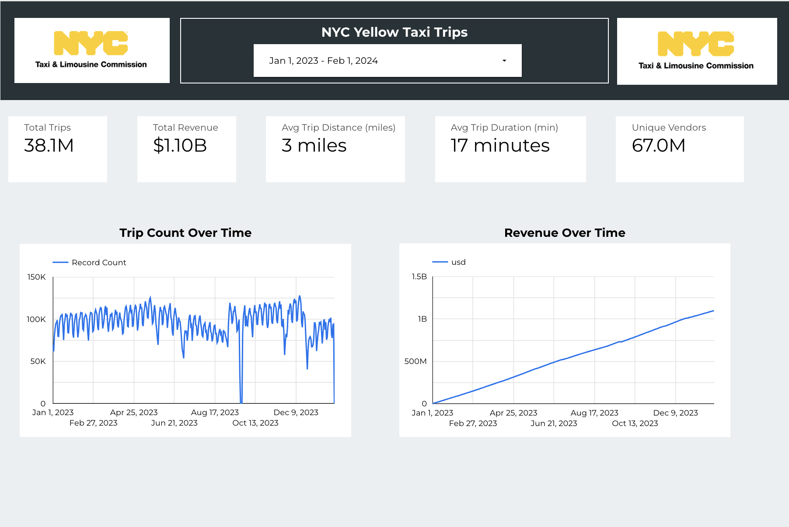
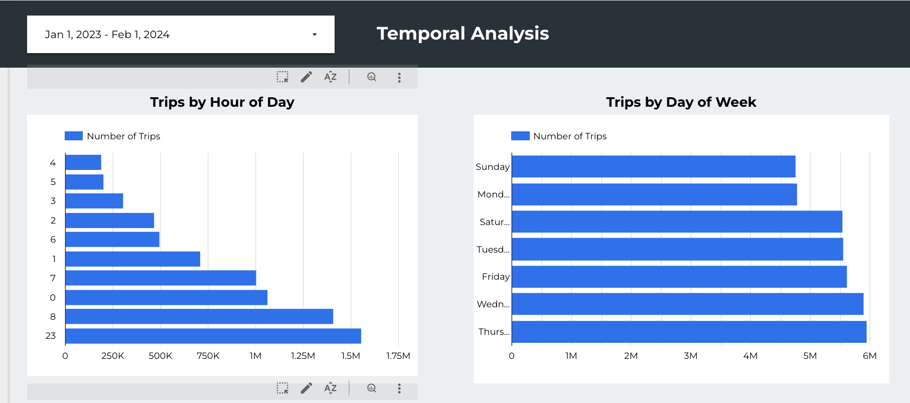
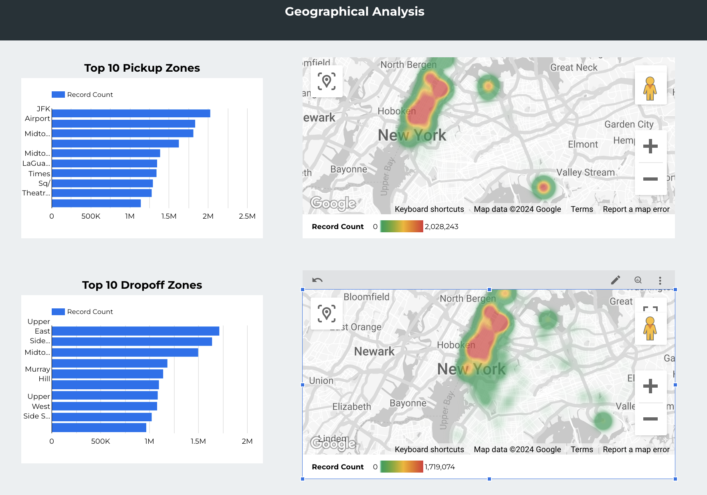
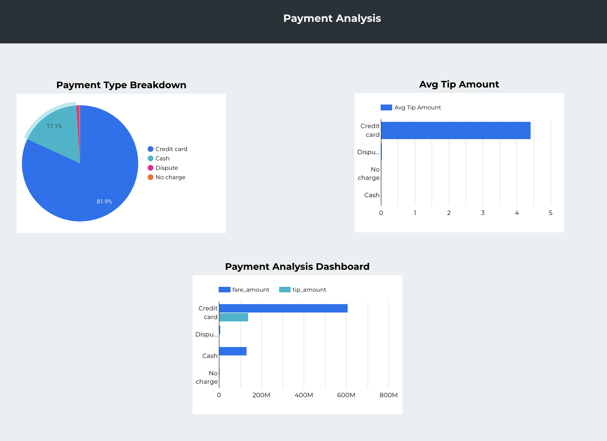
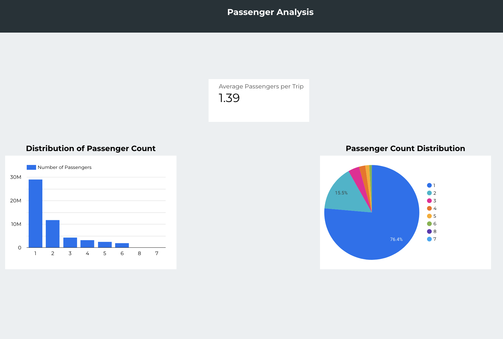

# NYC Taxi Data ETL Pipeline

## Overview

ETL (Extract, Transform, Load) pipeline for New York City taxi trip data using Apache Airflow and Google Cloud Platform (GCP).

## Tech

- Apache Airflow
- Google Cloud Platform (GCP)
  - Google Cloud Storage (GCS)
  - BigQuery
- Docker
- Python
- Pandas

## Data Analysis Dashboard












## Project Structure


1. Airflow DAG (`dags/nyc_taxi_etl.py`)
2. Data ingestion script (`scripts/ingest_data.py`)
3. Data transformation script (`scripts/transform_data.py`)
4. Dockerfile and docker-compose.yml for containerization

## Pipeline 

1. Download NYC taxi trip data in Parquet format
2. Upload raw data to Google Cloud Storage
3. Clean and transform the data
4. Upload transformed data to BigQuery

## DAG 


1. `download_parquet`: Downloads the Parquet file containing NYC taxi data
2. `upload_to_gcs`: Uploads the raw data to Google Cloud Storage
3. `clean_and_transform_data`: Processes and transforms the data
4. `upload_to_bigquery`: Loads the transformed data into BigQuery

## Environment Setup

The project uses environment variables for configuration:

- `GOOGLE_APPLICATION_CREDENTIALS`: Path to the GCP service account credentials file
- `GCP_BUCKET_ID`: ID of the Google Cloud Storage bucket
- `PROJECT_ID`: GCP project ID
- `BQ_DATASET_ID`: BigQuery dataset ID

## Setup and Running the Project

1. Clone the repository:
   ```
   git clone <repository-url>
   cd nyc-taxi-etl-pipeline
   ```

2. Set up environment variables:
   Create a `.env` file in the project root and add:
   ```
   GOOGLE_APPLICATION_CREDENTIALS=/path/to/your/credentials.json
   GCP_BUCKET_ID=your-gcs-bucket-id
   PROJECT_ID=your-gcp-project-id
   BQ_DATASET_ID=your-bigquery-dataset-id
   ```

3. Build and start Docker containers:
   ```
   docker-compose up -d
   ```

4. Access Airflow web UI:
   Open `http://localhost:8080` in your browser

5. Run the pipeline:
   - In the Airflow UI, find the `nyc_taxi_etl` DAG
   - Toggle the DAG on and trigger it manually

6. Monitor the pipeline:
   - Check task status in the Airflow UI
   - View logs for each task for detailed information

7. Shut down :
   ```
   docker-compose down
   ```

## Running the Pipeline

1. Ensure all required environment variables are set
2. Start the Airflow webserver and scheduler
3. Trigger the DAG manually or wait for the scheduled run